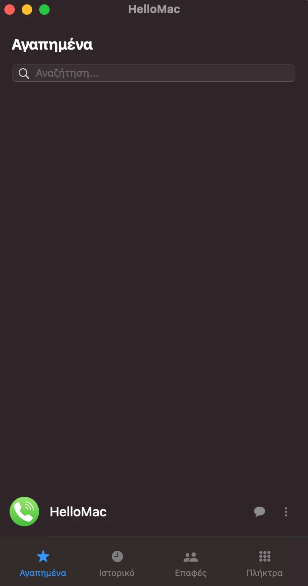
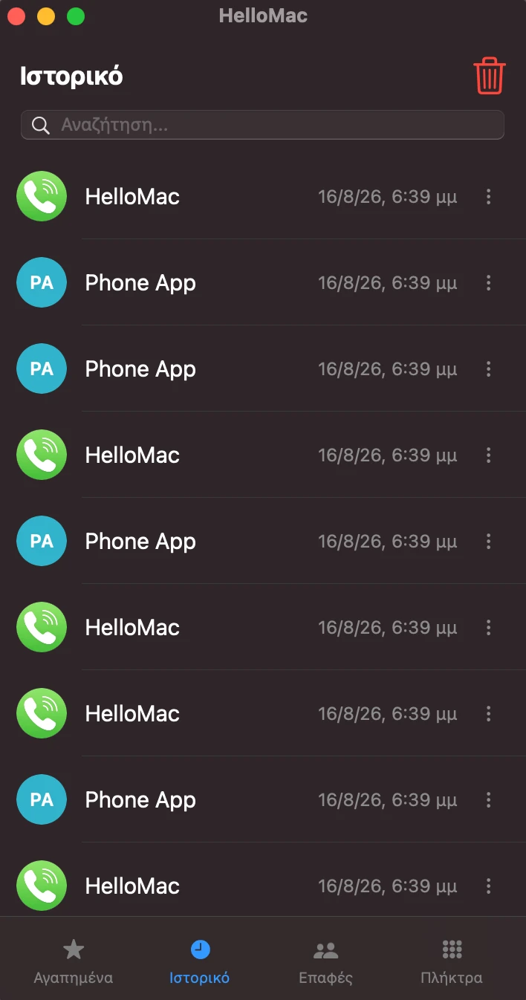
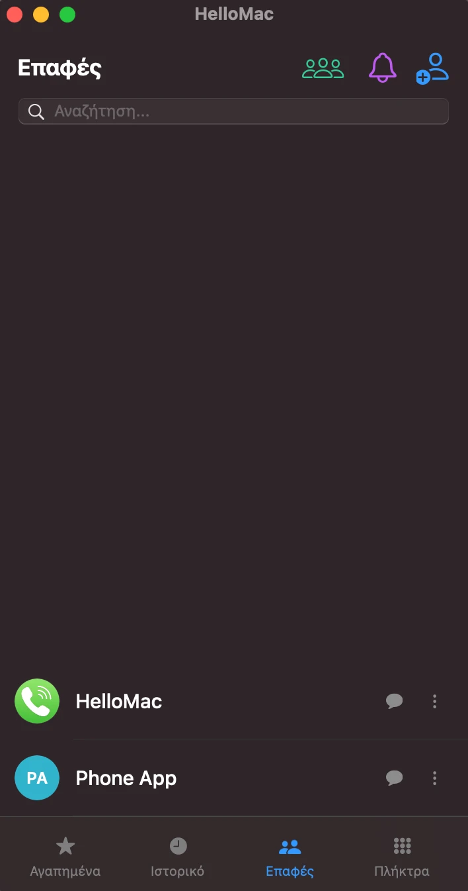
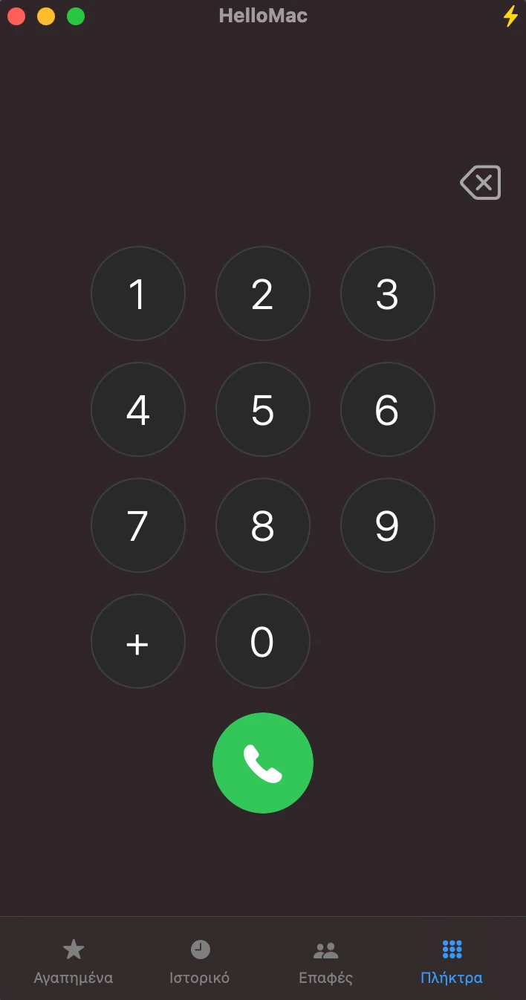
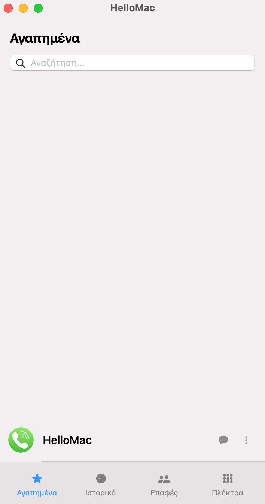
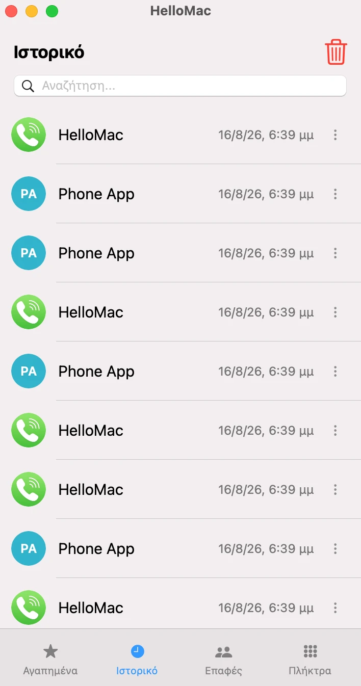
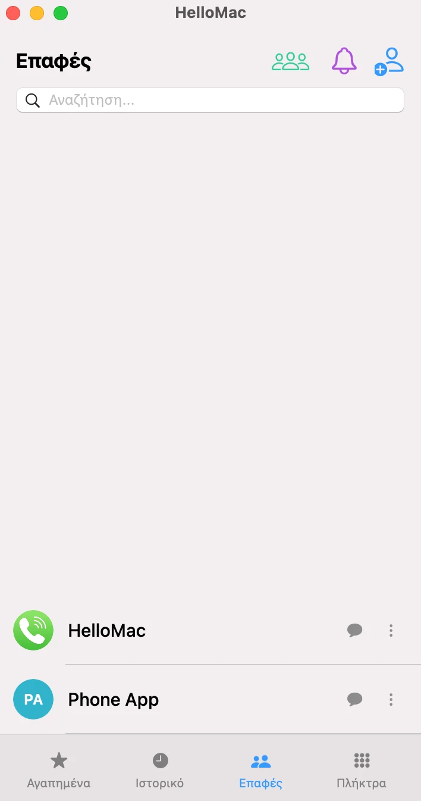
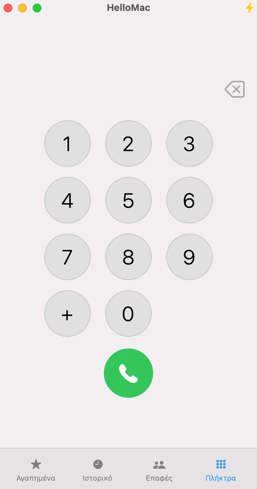

  

<h1 align="center">HelloMac</h1>

  <strong>Πραγματοποιήστε κλήσεις απευθείας από το Mac σας μέσω του iPhone.</strong> 
  Μια ταχύτατη και ελαφριά εφαρμογή με γνώριμο περιβάλλον τηλεφώνου, σχεδιασμένη ειδικά για παλαιότερα macOS.

  <a href="https://konstantinos2106.github.io/HelloMac/" target="_blank"><strong>🌐 Επισκεφθείτε την Επίσημη Ιστοσελίδα</strong></a> &nbsp;&nbsp;|&nbsp;&nbsp; 
  <a href="https://github.com/Konstantinos2106/HelloMac/"><strong>🇬🇧 Read in English</strong></a>

  
  
  

---

## 🚀 Σχετικά με το HelloMac

Στις παλαιότερες εκδόσεις του macOS (πριν την έκδοση 26 'Tahoe') δεν υπάρχει αυτόνομη εφαρμογή "Τηλέφωνο", με αποτέλεσμα οι χρήστες να πρέπει να ανοίγουν το FaceTime ή τις Επαφές τους για μια απλή κλήση. Το **HelloMac** έρχεται να λύσει αυτό το πρόβλημα, προσφέροντας ένα καθαρό, ελαφρύ και γνώριμο περιβάλλον τηλεφώνου.

<strong>📸 Κάντε κλικ για να δείτε Στιγμιότυπα της Εφαρμογής</strong>

 

### Σκουρόχρωμη Λειτουργία
| Αγαπημένα | Ιστορικό | Επαφές | Πλήκτρα |
| :---: | :---: | :---: | :---: |
|  |  |  | 

### Ανοιχτόχρωμη Λειτουργία
| Αγαπημένα | Ιστορικό | Επαφές | Πλήκτρα |
| :---: | :---: | :---: | :---: |
|  |  |  | 

## ✨ Χαρακτηριστικά

* 🌓 **Native macOS UI:** Πλήρης υποστήριξη Dark & Light Mode, εφέ ημιδιαφάνειας (Vibrancy) και οικεία αίσθηση iPhone.
* 📇 **Επαφές macOS (iCloud):** Άμεσος συγχρονισμός με τις εγγενείς επαφές της Apple (iCloud).
* 🔒 **Menu Bar & Λειτουργία Απορρήτου:** Κλήσεις από την πάνω μπάρα και προστασία απόκρυψης δεδομένων κατά την κοινή χρήση οθόνης σε meetings.
* ⚡ **Κλήση από Παντού:** Μαρκάρετε οποιονδήποτε αριθμό και καλέστε άμεσα μέσω των Υπηρεσιών Συστήματος (System Services).
* ⭐ **Αγαπημένα & Λίστα Επαφών:** Γρήγορη πρόσβαση, drag & drop ταξινόμηση, προσθήκη/επεξεργασία, και έξυπνο ζουμ φωτογραφιών.
* 🔍 **Αναζήτηση & Ιστορικό:** Λειτουργία έξυπνης αναζήτησης και πλήρες ιστορικό των κλήσεών σας με ημερομηνία και ώρα.
* 📞 **Κλασικό Πληκτρολόγιο & Ταχεία Κλήση:** Καντράν για γρήγορη πληκτρολόγηση και υποστήριξη ταχείας κλήσης (ανάθεση επαφών στα πλήκτρα 1-9).
* 🔔 **Υπενθυμίσεις & Σημειώσεις:** Ορίστε ειδοποιήσεις μελλοντικών κλήσεων και κρατήστε προσωπικές σημειώσεις για τις επαφές σας.
* 💬 **SMS & iMessage:** Άμεση αποστολή μηνυμάτων μέσω της εγγενούς εφαρμογής Μηνύματα του macOS.
* ♿ **Προσβασιμότητα & Ζώνη Ώρας:** Υψηλή αντίθεση, μεγέθυνση κειμένου, ασπρόμαυρη προβολή και χειροκίνητη επιλογή ζώνης ώρας.
* 💾 **Αντίγραφα Ασφαλείας & Αυτόματες Ενημερώσεις:** Τοπικά αντίγραφα ασφαλείας δεδομένων (επαφές, ιστορικό) και έξυπνες ενημερώσεις στο παρασκήνιο.

## 📥 Εγκατάσταση & Οδηγίες

1. Μεταβείτε στη σελίδα [Releases](https://github.com/Konstantinos2106/HelloMac/releases).
2. Κατεβάστε το αρχείο της τελευταίας έκδοσης: `HelloMac.v.X.X.X.dmg`.
3. Ανοίξτε το αρχείο και σύρετε το **HelloMac** στον φάκελο `Εφαρμογές` (Applications).
4. **Σημαντικό για την πρώτη εκκίνηση:** Αν εμφανιστεί η προειδοποίηση *"Μη Αναγνωρισμένος Δημιουργός"*, μεταβείτε στο `Finder → Εφαρμογές` (⇧⌘A), κάντε δεξί κλικ στο HelloMac και επιλέξτε **Άνοιγμα** ή κρατήστε πατημένο το `Control` και κάντε κλικ στην εφαρμογή. Στο παράθυρο που θα εμφανιστεί, πατήστε ξανά **Άνοιγμα**.

**Απαιτήσεις Συστήματος:**
* Συμβατότητα: **macOS Big Sur, Monterey, Ventura, Sonoma, Sequoia**
* Το Mac και το iPhone πρέπει να είναι συνδεδεμένα στο ίδιο δίκτυο Wi-Fi και στο ίδιο Apple ID.
* Πρέπει να είναι ενεργοποιημένο το iPhone Handoff (`Ρυθμίσεις → Τηλέφωνο → Κλήσεις σε άλλες συσκευές`).

## ⚙️ Πώς λειτουργεί (FaceTime Workaround)

Το HelloMac χρησιμοποιεί έναν έξυπνο μηχανισμό στο παρασκήνιο. Προωθεί την κλήση μέσω του πρωτοκόλλου `tel://` χρησιμοποιώντας το FaceTime. Όμως, για να σας προσφέρει την εμπειρία μιας πραγματικά αυτόνομης εφαρμογής, το HelloMac κρύβει αυτόματα το παράθυρο του FaceTime, αφήνοντάς σας να διαχειρίζεστε την κλήση σας ανενόχλητοι στο δικό του καθαρό περιβάλλον.

## ✉️ Υποστήριξη & Επικοινωνία

Το HelloMac είναι ένα ενεργό project που ανανεώνεται συνεχώς. Αν συναντήσετε κάποιο σφάλμα (bug) ή έχετε ιδέες για νέα χαρακτηριστικά, μπορείτε να ανοίξετε ένα [Issue](https://github.com/Konstantinos2106/HelloMac/issues) ή να επικοινωνήσετε μαζί μου απευθείας στο:
**[hellomac.support@gmail.com](mailto:hellomac.support@gmail.com)**

Διαχείριση Sveltia CMS: [Είσοδος](https://konstantinos2106.github.io/HelloMac/admin/)

## 📜 Άδεια Χρήσης & Αποποίηση Ευθύνης

Αυτό το project είναι ανοιχτού κώδικα και διατίθεται υπό την [Άδεια GPL-3.0](LICENSE).

*Το HelloMac είναι ένα ανεξάρτητο project ανοιχτού κώδικα και δεν σχετίζεται, δεν υποστηρίζεται ούτε χρηματοδοτείται από την Apple Inc. Τα ονόματα iPhone, Mac, macOS και FaceTime είναι εμπορικά σήματα της Apple Inc.*
