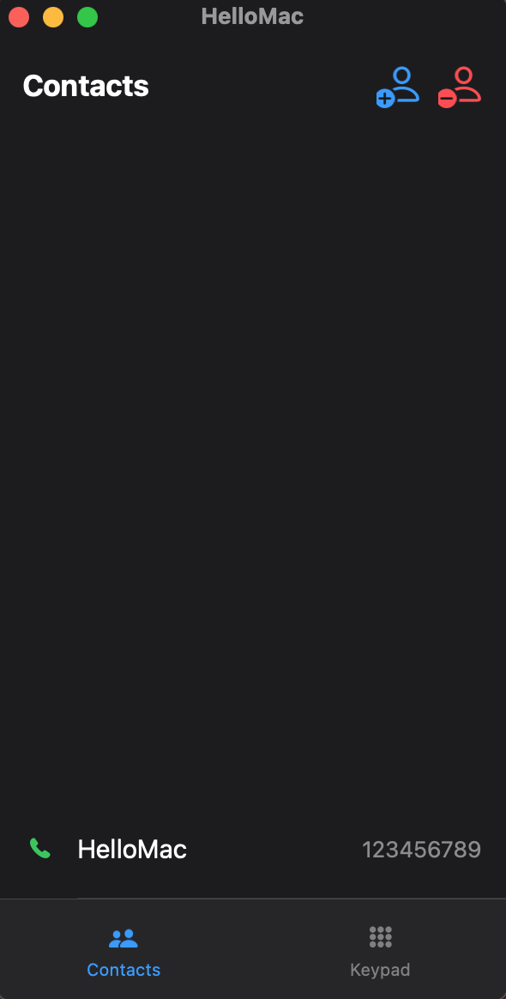
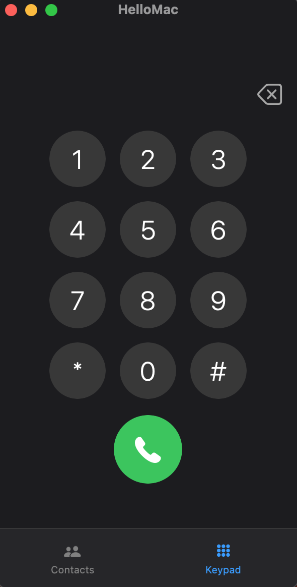

  

  

<h1 align="center">HelloMac</h1>

  <strong>Make calls directly from your Mac via your iPhone. A blazing-fast and lightweight app, featuring a classic dialpad and a full contacts list.</strong>  
  <strong>Πραγματοποιήστε κλήσεις απευθείας από το Mac σας μέσω του iPhone. Μια ταχύτατη και ελαφριά εφαρμογή, με κλασικό πληκτρολόγιο και πλήρη λίστα επαφών.</strong>

  

  <strong>Update the application manually for one last time to version 2.0 to enable the new automatic updates feature.</strong>  
  <strong>Ενημερώστε την εφαρμογή χειροκίνητα για μια τελευταία φορά στην έκδοση 2.0 ώστε να εφαρμόστετε την νέα λειτουργία αυτοματοποιημένων ενημερώσεων.</strong>

---

## 📸 Screenshots / Στιγμιότυπα

  
  &nbsp; &nbsp; &nbsp;
  

---
## About HelloMac

In older versions of macOS (before version 26 'Tahoe'), there is no standalone 'Phone' app, forcing users to open FaceTime or Contacts for a simple call. 
**HelloMac** solves this issue by offering a clean, lightweight, and familiar phone interface.

### ✨ Features
* **Native macOS UI:** Design that integrates seamlessly with the operating system.
* **Contact Management:** Add, remove, and quickly view your contacts.
* **Classic Keypad:** Easy-to-use dialer for quick number entry.

### ⚙️ How it works (FaceTime Workaround)
HelloMac uses a clever background mechanism. It routes calls via the `tel://` protocol using FaceTime. However, to provide the experience of a truly standalone application, HelloMac automatically hides the FaceTime window, allowing you to manage your call undisturbed.

### 📥 Installation
1. Go to the [Releases](../../releases) page.
2. Download the latest version: `HelloMac.Χ.Χ.Χ.dmg`.
3. Open the file and drag **HelloMac** to your `Applications` folder.

### ✉️ Contact
You can contact me for suggestions and issues via email [here](mailto:hellomac.support@gmail.com).

### ✏️ Notes
* **Compatible with:** macOS Big Sur, macOS Monterey, macOS Ventura, macOS Sonoma, macOS Sequoia
* If an "Unidentified Developer" message appears on first launch, follow the guide [here](PDF/Unrecognized_Creator_EL.pdf).
* HelloMac is constantly being updated and evolved, so it may contain bugs.

### 📜 License
This project is available under the [MIT License](LICENSE) - see the LICENSE file for details. 
HelloMac is an open-source project and is not affiliated with, endorsed by, or sponsored by Apple Inc. or any other entity. iPhone, Mac, macOS, and FaceTime are trademarks of Apple Inc.

---

## Σχετικά με το HelloMac

Στις παλαιότερες εκδόσεις του macOS (πριν την έκδοση 26 'Tahoe') δεν υπάρχει αυτόνομη εφαρμογή "Τηλέφωνο", με αποτέλεσμα οι χρήστες να πρέπει να ανοίγουν το FaceTime ή τις Επαφές τους για μια απλή κλήση. 
Το **HelloMac** έρχεται να λύσει αυτό το πρόβλημα, προσφέροντας ένα καθαρό, ελαφρύ και γνώριμο περιβάλλον τηλεφώνου.

### ✨ Χαρακτηριστικά
* **Native macOS UI:** Σχεδιασμός που δένει άψογα με το λειτουργικό.
* **Διαχείριση Επαφών:** Προσθήκη, αφαίρεση και γρήγορη προβολή των επαφών σας.
* **Κλασικό Πληκτρολόγιο:** Εύχρηστο καντράν για γρήγορη πληκτρολόγηση αριθμών.

### ⚙️ Πώς λειτουργεί (FaceTime Workaround)
Το HelloMac χρησιμοποιεί έναν έξυπνο μηχανισμό στο παρασκήνιο. Προωθεί την κλήση μέσω του πρωτοκόλλου `tel://` χρησιμοποιώντας το FaceTime. Όμως, για να σας προσφέρει την εμπειρία μιας πραγματικά αυτόνομης εφαρμογής, το HelloMac κρύβει αυτόματα το παράθυρο του FaceTime, αφήνοντάς σας να διαχειρίζεστε την κλήση σας ανενόχλητοι.

### 📥 Εγκατάσταση
1. Μεταβείτε στη σελίδα [Releases](../../releases).
2. Κατεβάστε το αρχείο `HelloMac.Χ.Χ.Χ.dmg`.
3. Ανοίξτε το και σύρετε το **HelloMac** στον φάκελο `Εφαρμογές` (Applications).

### ✉️ Επικοινωνία
Μπορείτε να επικοινωνήσετε μαζί μου για νέες ιδέες και προβλήματα μέσω email [εδώ](mailto:hellomac.support@gmail.com).

### ✏️ Σημειώσεις
* **Συμβατό με:** macOS Big Sur, macOS Monterey, macOS Ventura, macOS Sonoma, macOS Sequoia
* Σε περίπτωση που στην πρώτη εκκίνηση εμφανιστεί μήνυμα "Μη Αναγνωρισμένου Δημιουργού", ακολουθήστε τον οδηγό [εδώ](PDF/Unrecognized_Creator_EL.pdf).
* Το HelloMac ανανεώνεται συνεχώς, εξελίσσεται και μπορεί να περιέχει και λάθη.

### 📜 Άδεια Χρήσης
Αυτό το project διατίθεται υπό την [Άδεια MIT](LICENSE) - δείτε το αρχείο LICENSE για λεπτομέρειες. 
Το HelloMac είναι ένα project ανοιχτού κώδικα και δεν σχετίζεται, δεν υποστηρίζεται ούτε χρηματοδοτείται από την Apple Inc ή κάποια άλλη πηγή. Τα ονόματα iPhone, Mac, macOS και FaceTime είναι εμπορικά σήματα της Apple Inc.  

 
