

  

  

<h1 align="center">HelloMac</h1>

  <strong>Make calls directly from your Mac via your iPhone. A blazing-fast and lightweight app, featuring a classic dialpad and a full contacts list.</strong>  
  <strong>Πραγματοποιήστε κλήσεις απευθείας από το Mac σας μέσω του iPhone. Μια ταχύτατη και ελαφριά εφαρμογή, με κλασικό πληκτρολόγιο και πλήρη λίστα επαφών.</strong>

  
  

---

## About HelloMac

In older versions of macOS (before version 26 'Tahoe'), there is no standalone 'Phone' app, forcing users to open FaceTime or Contacts for a simple call. 
**HelloMac** solves this issue by offering a clean, lightweight, and familiar phone interface.

### ✨ Features

* **Native macOS UI:** Full Dark & Light Mode support, Native Vibrancy effect (translucency), and a familiar iPhone feel.
* **macOS Contacts (iCloud):** Direct synchronization with your native Apple Contacts.
* **Menu Bar & Privacy Mode:** One-click calling from the menu bar and screen-share protection that hides sensitive data.
* **Call from Anywhere:** Highlight any number and call instantly via macOS System Services.
* **Favorites & Contact List:** Quick access, drag & drop sorting, add/edit functionality, and smart zoom for profile photos.
* **Search & History:** Smart search functionality and full call history with date and time.
* **Classic & Speed Dial Keypad:** Dialpad for quick entry and speed dial support (assign contacts to keys 1-9).
* **Call Reminders & Notes:** Set custom alerts and keep personalized text notes for your contacts.
* **SMS & iMessage:** Instantly send messages directly via the native macOS Messages app.
* **Accessibility & Time Zone:** High contrast, text scaling, black & white view, and manual time zone selection.
* **Backups & Auto-Updates:** Create full local data backups and enjoy smart background updates.

### 📸 Screenshots (Dark Mode)

  
  &nbsp;
  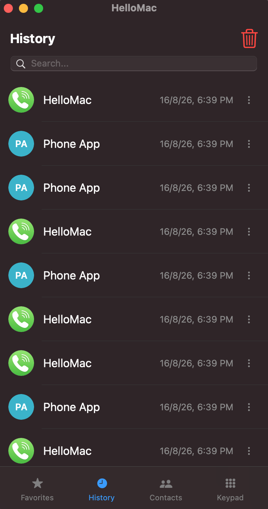
  &nbsp;
  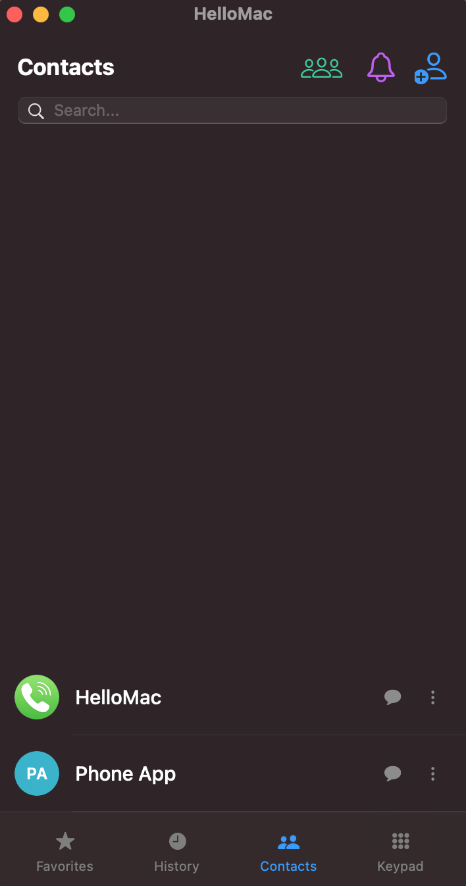
  &nbsp;
  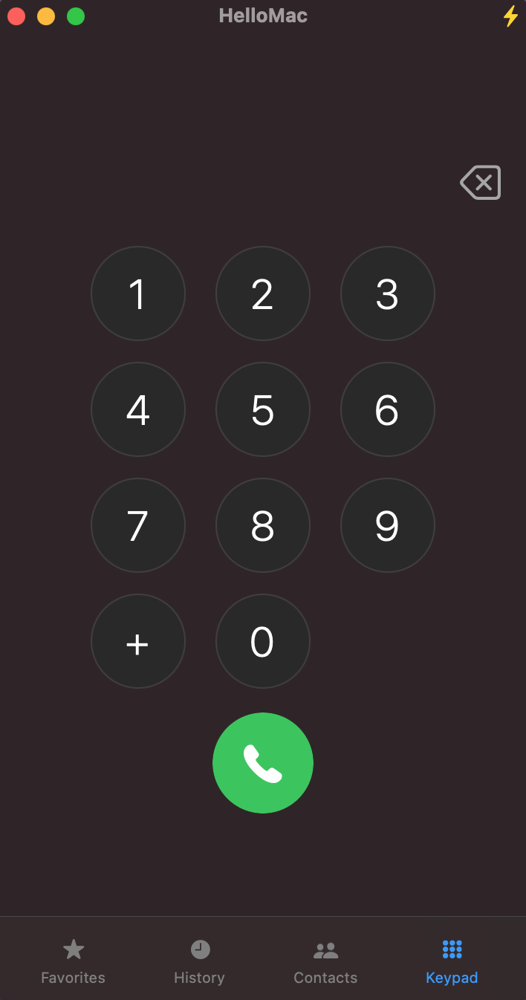
  &nbsp;
  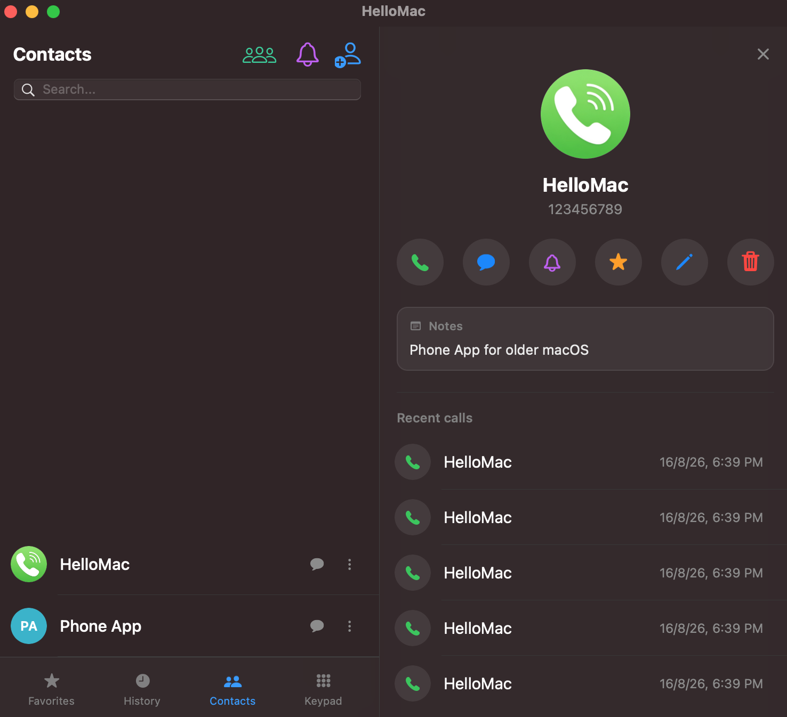

### 📸 Screenshots (Light Mode)

  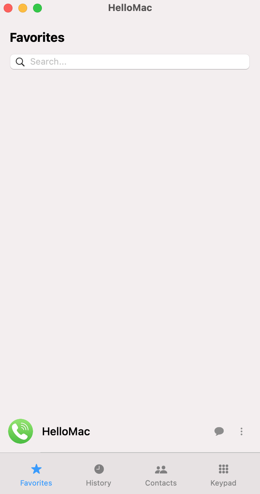
  &nbsp;
  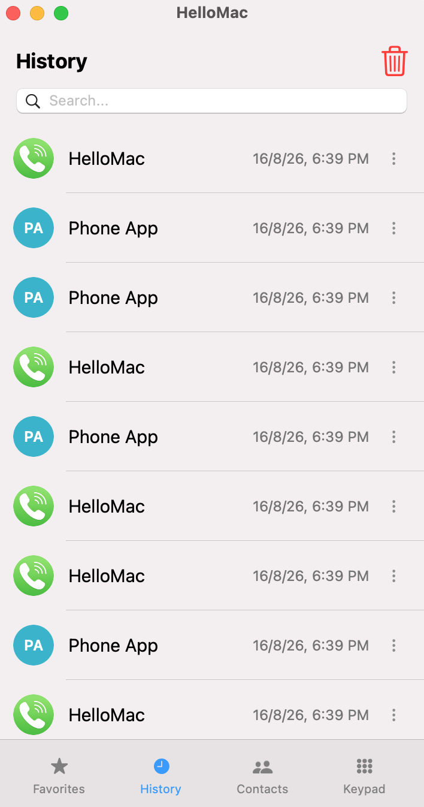
  &nbsp;
  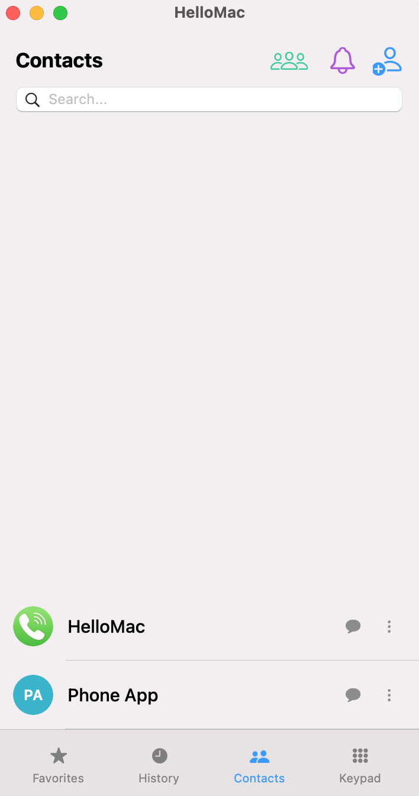
  &nbsp;
  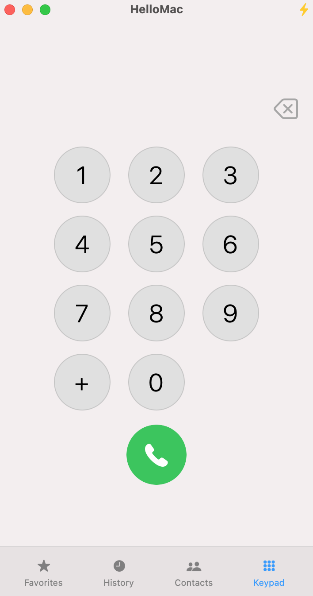
  &nbsp;
  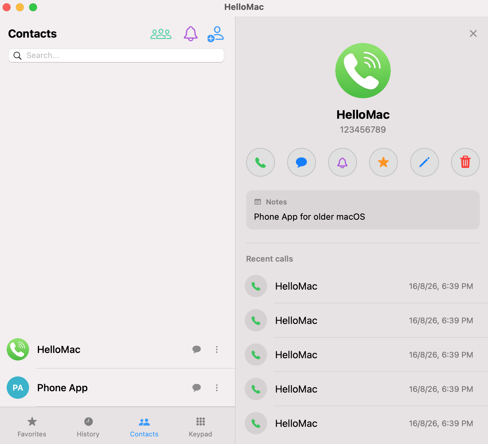

### 📥 Installation

1. Go to the [Releases](../../releases) page.
2. Download the latest version: `HelloMac.v.Χ.Χ.Χ.dmg`.
3. Open the file and drag **HelloMac** to your `Applications` folder.

### ✏️ Notes

* **Compatible with:** macOS Big Sur, macOS Monterey, macOS Ventura, macOS Sonoma, macOS Sequoia
* If **"Unidentified Developer"** appears on first launch, go to `Finder → Applications` (⇧⌘A), right-click HelloMac and choose `Open`, or hold down `Control` and click the app. In the dialog that appears, click `Open` again.
* HelloMac is constantly being updated and evolved, so it may contain bugs.
* Sveltia CMS Administration: https://konstantinos2106.github.io/HelloMac/admin/

### ⚙️ How it works (FaceTime Workaround)

HelloMac uses a clever background mechanism. It routes calls via the `tel://` protocol using FaceTime. However, to provide the experience of a truly standalone application, HelloMac automatically hides the FaceTime window, allowing you to manage your call undisturbed.

### ✉️ Contact

You can contact me for suggestions and issues via email [here](mailto:hellomac.support@gmail.com).

### 📜 License

This project is available under the [GPL-3.0 License](LICENSE) - see the LICENSE file for details. 
HelloMac is an open-source project and is not affiliated with, endorsed by, or sponsored by Apple Inc. or any other entity. iPhone, Mac, macOS, and FaceTime are trademarks of Apple Inc.

 

_For automatic updates you must have at least version 2.0. Previous versions do not have an automatic checking and updating mechanism._

---

## Σχετικά με το HelloMac

Στις παλαιότερες εκδόσεις του macOS (πριν την έκδοση 26 'Tahoe') δεν υπάρχει αυτόνομη εφαρμογή "Τηλέφωνο", με αποτέλεσμα οι χρήστες να πρέπει να ανοίγουν το FaceTime ή τις Επαφές τους για μια απλή κλήση. 
Το **HelloMac** έρχεται να λύσει αυτό το πρόβλημα, προσφέροντας ένα καθαρό, ελαφρύ και γνώριμο περιβάλλον τηλεφώνου.

### ✨ Χαρακτηριστικά

* **Native macOS UI:** Πλήρης υποστήριξη Dark & Light Mode, εφέ ημιδιαφάνειας (Vibrancy) και οικεία αίσθηση iPhone.
* **Επαφές macOS (iCloud):** Άμεσος συγχρονισμός με τις εγγενείς επαφές της Apple (iCloud).
* **Menu Bar & Λειτουργία Απορρήτου:** Κλήσεις από την πάνω μπάρα και προστασία απόκρυψης δεδομένων κατά την κοινή χρήση οθόνης.
* **Κλήση από Παντού:** Μαρκάρετε οποιονδήποτε αριθμό και καλέστε άμεσα μέσω των Υπηρεσιών Συστήματος (System Services).
* **Αγαπημένα & Λίστα Επαφών:** Γρήγορη πρόσβαση, drag & drop ταξινόμηση, προσθήκη/επεξεργασία, και έξυπνο ζουμ φωτογραφιών.
* **Αναζήτηση & Ιστορικό:** Λειτουργία έξυπνης αναζήτησης και πλήρες ιστορικό των κλήσεών σας με ημερομηνία και ώρα.
* **Κλασικό Πληκτρολόγιο & Ταχεία Κλήση:** Καντράν για γρήγορη πληκτρολόγηση και υποστήριξη ταχείας κλήσης (στα πλήκτρα 1-9).
* **Υπενθυμίσεις & Σημειώσεις:** Ορίστε ειδοποιήσεις μελλοντικών κλήσεων και κρατήστε προσωπικές σημειώσεις για τις επαφές σας.
* **SMS & iMessage:** Άμεση αποστολή μηνυμάτων μέσω της εγγενούς εφαρμογής Μηνύματα του macOS.
* **Προσβασιμότητα & Ζώνη Ώρας:** Υψηλή αντίθεση, μεγέθυνση κειμένου, ασπρόμαυρη προβολή και χειροκίνητη επιλογή ζώνης ώρας.
* **Αντίγραφα Ασφαλείας & Αυτόματες Ενημερώσεις:** Τοπικά αντίγραφα ασφαλείας δεδομένων και έξυπνες ενημερώσεις στο παρασκήνιο.

### 📸 Στιγμιότυπα (Σκουρόχρωμη Λειτουργία)

  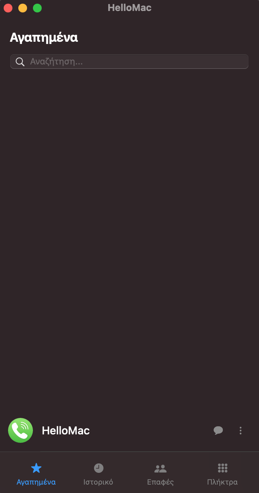
  &nbsp;
  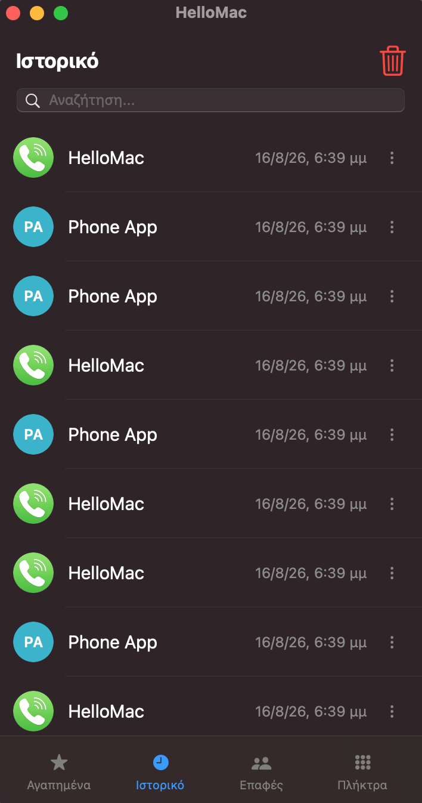
  &nbsp;
  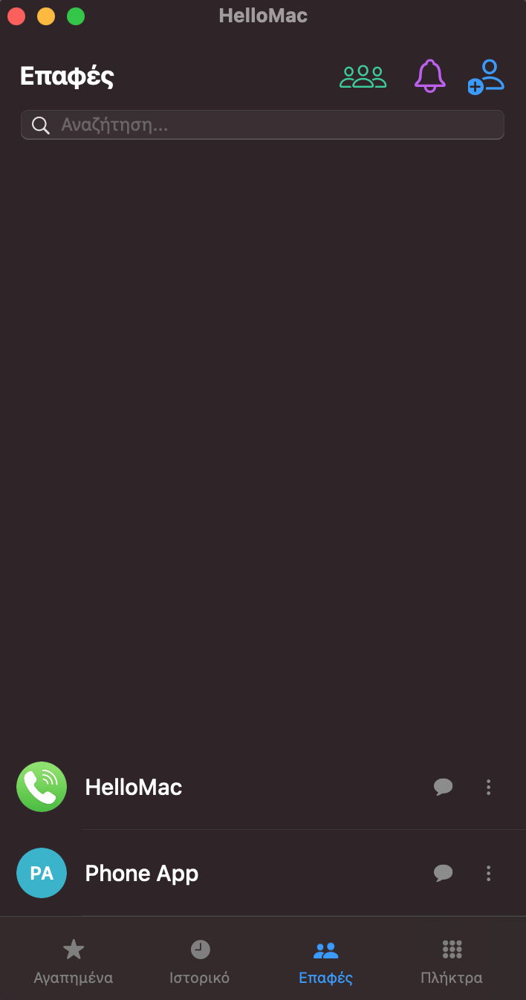
  &nbsp;
  
  &nbsp;
  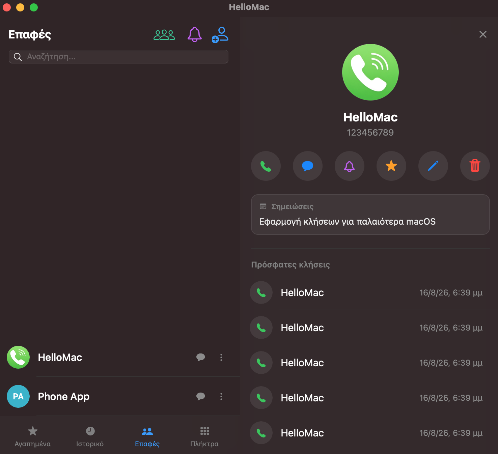

### 📸 Στιγμιότυπα (Ανοιχτόχρωμη Λειτουργία)

  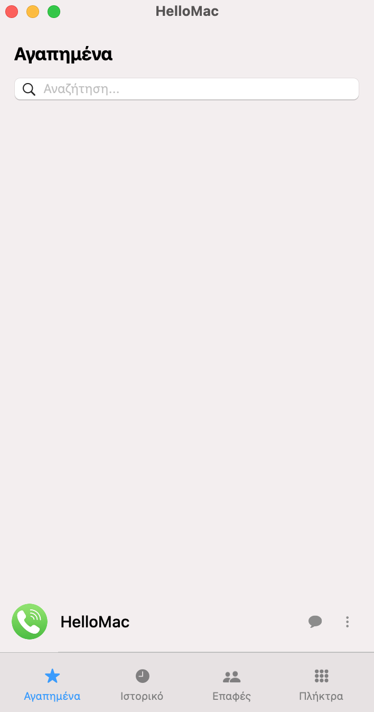
  &nbsp;
  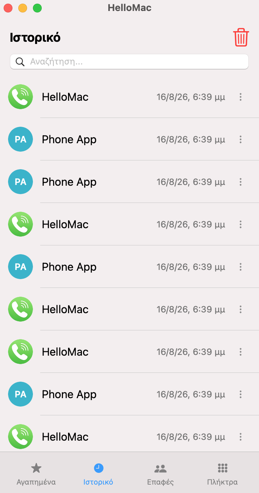
  &nbsp;
  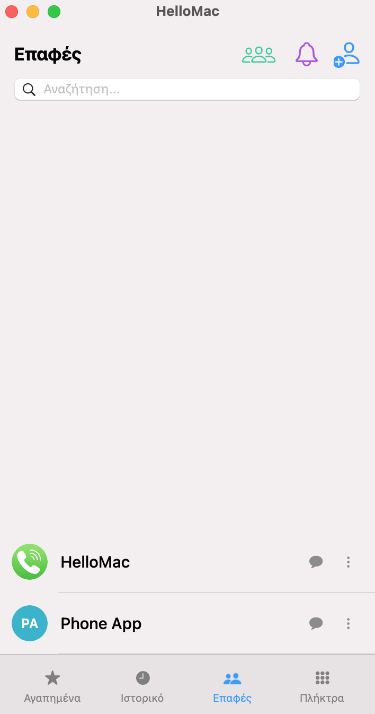
  &nbsp;
  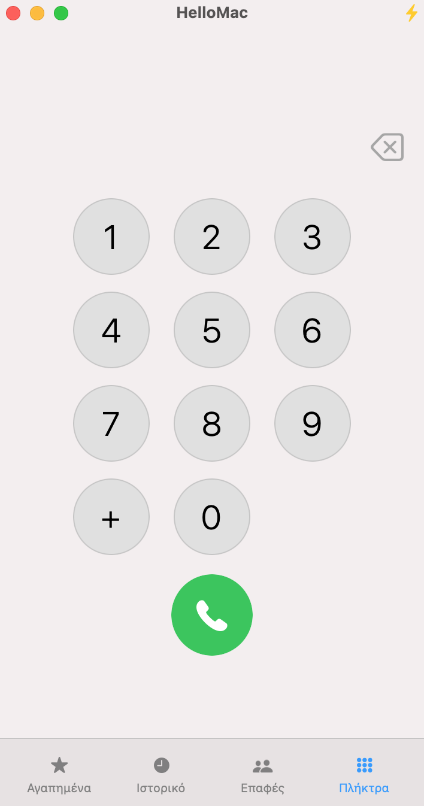
  &nbsp;
  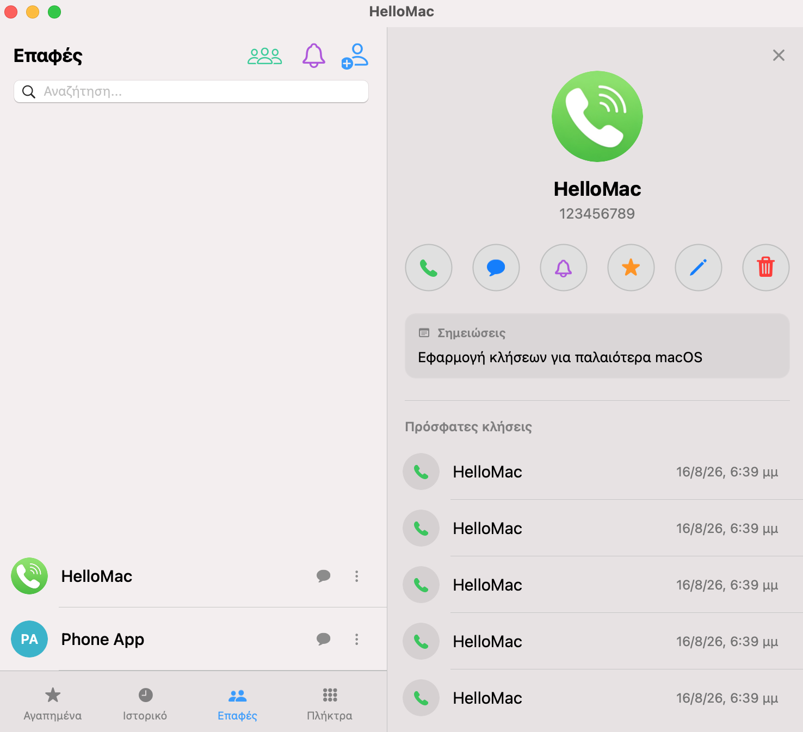

### 📥 Εγκατάσταση

1. Μεταβείτε στη σελίδα [Releases](../../releases).
2. Κατεβάστε το αρχείο `HelloMac.v.Χ.Χ.Χ.dmg`.
3. Ανοίξτε το και σύρετε το **HelloMac** στον φάκελο `Εφαρμογές` (Applications).

### ✏️ Σημειώσεις

* **Συμβατό με:** macOS Big Sur, macOS Monterey, macOS Ventura, macOS Sonoma, macOS Sequoia
* Αν εμφανιστεί στην πρώτη εκκίνηση **"Μη Αναγνωρισμένος Δημιουργός"**, πηγαίνετε στο `Finder → Εφαρμογές` (⇧⌘A), κάντε δεξί κλικ στο HelloMac και επιλέξτε `Άνοιγμα` ή κρατήστε πατημένο το `Control` και κάντε κλικ στην εφαρμογή. Στο παράθυρο που θα εμφανιστεί, πατήστε ξανά `Άνοιγμα`.
* Το HelloMac ανανεώνεται συνεχώς, εξελίσσεται και μπορεί να περιέχει και λάθη.
* Διαχείριση Sveltia CMS: https://konstantinos2106.github.io/HelloMac/admin/

### ⚙️ Πώς λειτουργεί (FaceTime Workaround)

Το HelloMac χρησιμοποιεί έναν έξυπνο μηχανισμό στο παρασκήνιο. Προωθεί την κλήση μέσω του πρωτοκόλλου `tel://` χρησιμοποιώντας το FaceTime. Όμως, για να σας προσφέρει την εμπειρία μιας πραγματικά αυτόνομης εφαρμογής, το HelloMac κρύβει αυτόματα το παράθυρο του FaceTime, αφήνοντάς σας να διαχειρίζεστε την κλήση σας ανενόχλητοι.

### ✉️ Επικοινωνία

Μπορείτε να επικοινωνήσετε μαζί μου για νέες ιδέες και προβλήματα μέσω email [εδώ](mailto:hellomac.support@gmail.com).

### 📜 Άδεια Χρήσης

Αυτό το project διατίθεται υπό την [Άδεια GPL-3.0](LICENSE) - δείτε το αρχείο LICENSE για λεπτομέρειες. 
Το HelloMac είναι ένα project ανοιχτού κώδικα και δεν σχετίζεται, δεν υποστηρίζεται ούτε χρηματοδοτείται από την Apple Inc ή κάποια άλλη πηγή. Τα ονόματα iPhone, Mac, macOS και FaceTime είναι εμπορικά σήματα της Apple Inc.

 

_Για αυτόματες ενημερώσεις πρέπει να έχετε τουλάχιστον την έκδοση 2.0. Οι προηγούμενες εκδόσεις δεν διαθέτουν μηχανισμό αυτόματου ελέγχου και ενημέρωσης._
