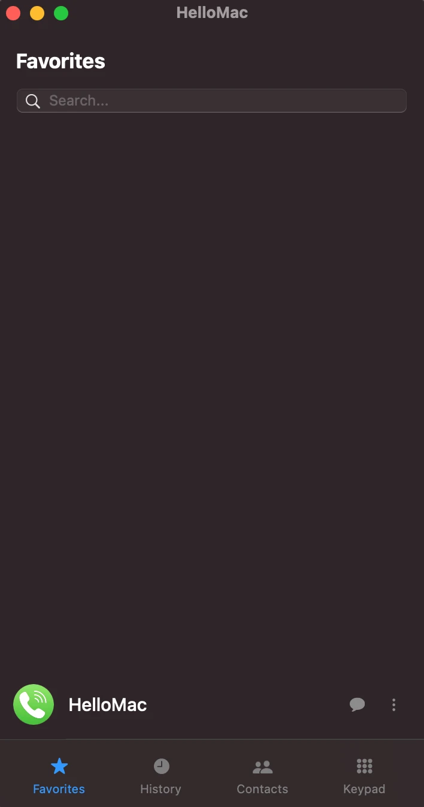
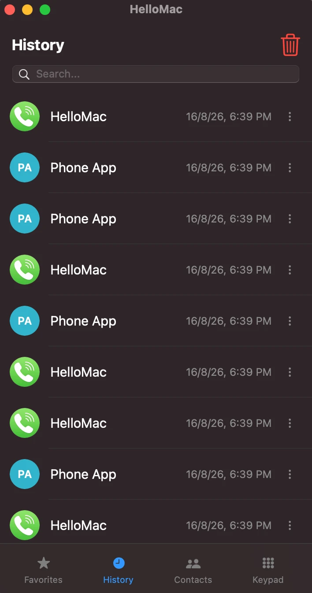
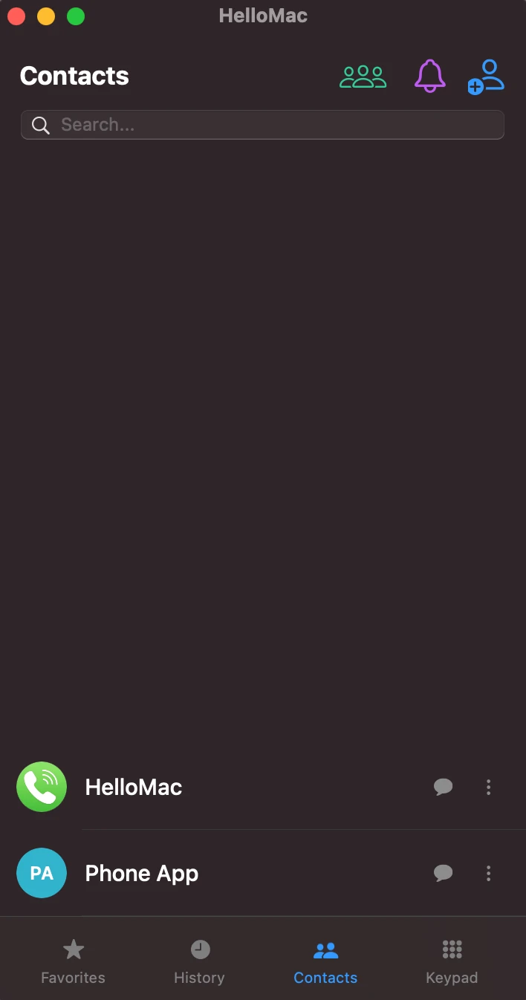
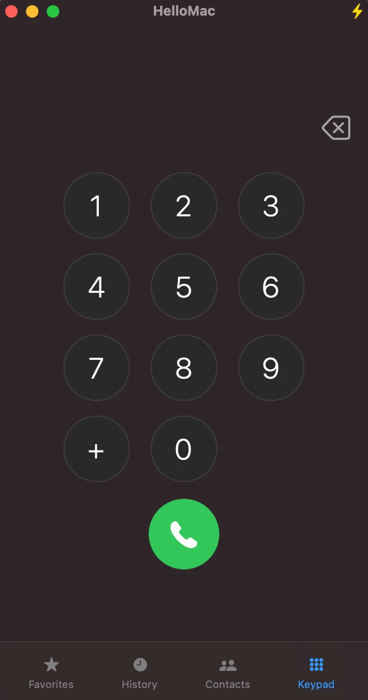
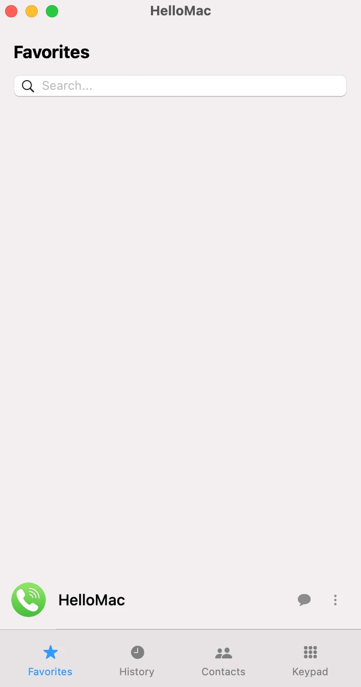
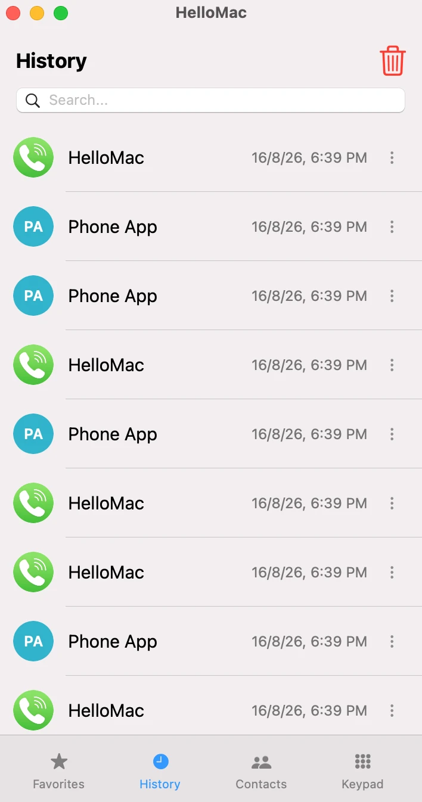
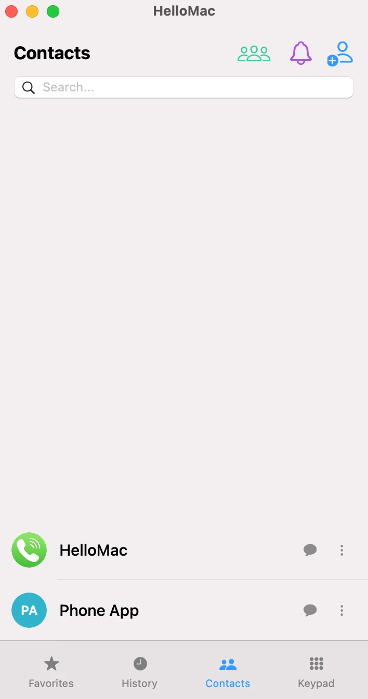
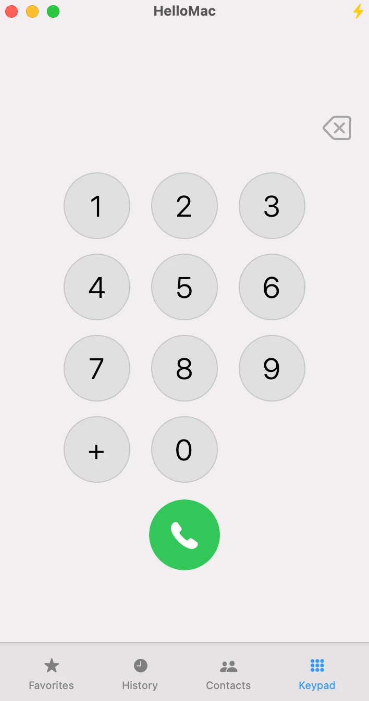

  

<h1 align="center">HelloMac</h1>

  <strong>Make calls directly from your Mac via your iPhone.</strong> 
  A blazing-fast, lightweight application with a familiar phone interface designed specifically for older macOS versions.

  <a href="https://konstantinos2106.github.io/HelloMac/" target="_blank"><strong>🌐 Visit the Official Website</strong></a> &nbsp;&nbsp;|&nbsp;&nbsp; 
  <a href="README.el.md"><strong>🇬🇷 Διαβάστε στα Ελληνικά</strong></a>

  
  
  

---

## 🚀 About HelloMac

In older versions of macOS (before version 26 'Tahoe'), there is no standalone 'Phone' app, forcing users to open FaceTime or Contacts for a simple call. **HelloMac** solves this issue by offering a clean, lightweight, and familiar phone interface.

<strong>📸 Click to view Application Screenshots</strong>

 

### Dark Mode
| Favorites | History | Contacts | Keypad |
| :---: | :---: | :---: | :---: |
|  |  |  |  |

### Light Mode
| Favorites | History | Contacts | Keypad |
| :---: | :---: | :---: | :---: |
|  |  |  |  |

## ✨ Features

* 🌓 **Native macOS UI:** Full Dark & Light Mode support, Native Vibrancy effect (translucency), and a familiar iPhone feel.
* 📇 **macOS Contacts (iCloud):** Direct synchronization with your native Apple Contacts.
* 🔒 **Menu Bar & Privacy Mode:** One-click calling from the menu bar and screen-share protection that hides sensitive data during meetings.
* ⚡ **Call from Anywhere:** Highlight any number and call instantly via macOS System Services.
* ⭐ **Favorites & Contact List:** Quick access, drag & drop sorting, add/edit functionality, and smart zoom for profile photos.
* 🔍 **Search & History:** Smart search functionality and full call history with date and time.
* 📞 **Classic & Speed Dial Keypad:** Dialpad for quick entry and speed dial support (assign contacts to keys 1-9).
* 🔔 **Call Reminders & Notes:** Set custom alerts and keep personalized text notes for your contacts.
* 💬 **SMS & iMessage:** Instantly send messages directly via the native macOS Messages app.
* ♿ **Accessibility & Time Zone:** High contrast, text scaling, black & white view, and manual time zone selection.
* 💾 **Backups & Auto-Updates:** Create full local data backups and enjoy smart background updates.

## 📥 Installation & Setup

1. Go to the [Releases](https://github.com/Konstantinos2106/HelloMac/releases) page.
2. Download the latest version: `HelloMac.v.X.X.X.dmg`.
3. Open the file and drag **HelloMac** into your `Applications` folder.
4. **Important for first launch:** If macOS shows an *"Unidentified Developer"* warning, go to `Finder → Applications` (⇧⌘A), right-click HelloMac and choose **Open**, or hold down `Control` and click the app. In the dialog that appears, click **Open** again.

**Requirements:**
* Compatible with: **macOS Big Sur, Monterey, Ventura, Sonoma, Sequoia**
* Both your iPhone and Mac must be on the same Wi-Fi network and Apple ID.
* iPhone Handoff must be enabled (`Settings → Phone → Calls on Other Devices`).

## ⚙️ How it works (FaceTime Workaround)

HelloMac uses a clever background mechanism. It routes calls via the `tel://` protocol using FaceTime. However, to provide the experience of a truly standalone application, HelloMac automatically hides the FaceTime window, allowing you to manage your call undisturbed in a clean UI.

## 🛠️ Documentation & Building

The codebase and the build process are fully open and accessible. You don't need to be a developer to compile HelloMac yourself. All the details can be found in our documentation files:
* [🗂️ Project Structure & Architecture](docs/STRUCTURE.md)
* [🛠️ Build from Source Guide](docs/BUILD.md)

## ✉️ Support & Contact

HelloMac is an active project and is constantly evolving. If you encounter any bugs or have feature suggestions, feel free to open an [Issue](https://github.com/Konstantinos2106/HelloMac/issues) or contact me directly at:
**[hellomac.support@gmail.com](mailto:hellomac.support@gmail.com)**

Sveltia CMS Administration: [Login Here](https://konstantinos2106.github.io/HelloMac/admin/)

## 📜 License & Disclaimer

This project is open-source and available under the [GPL-3.0 License](LICENSE).

*HelloMac is an independent open-source project and is not affiliated with, endorsed by, or sponsored by Apple Inc. iPhone, Mac, macOS, and FaceTime are registered trademarks of Apple Inc.*
